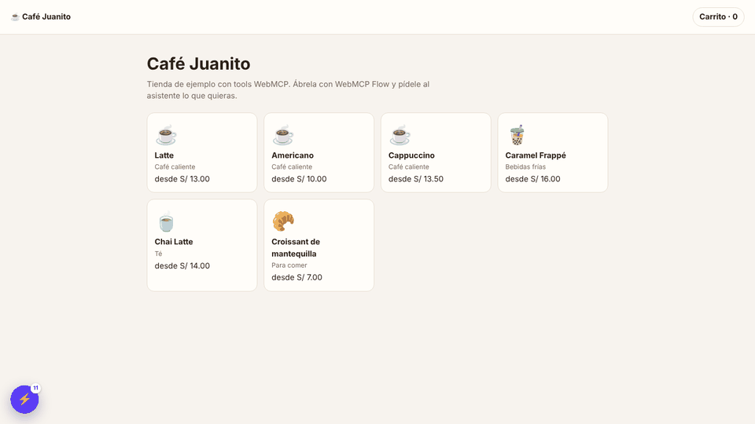

# WebMCP Flow

[](https://github.com/yahyrparedes/webmcp-flow/actions/workflows/ci.yml)
[](LICENSE)

**Test your site's WebMCP tools end to end, with a chat that uses them the way an AI agent would.** · [Español](README.es.md) · [Project page](https://yahyrparedes.github.io/webmcp-flow/)

WebMCP Flow is a Chrome extension for teams that expose [WebMCP](https://github.com/webmachinelearning/webmcp) tools on their sites. Open your site, type what a customer would ask ("add the cheapest latte to my cart and take me to pay"), and watch a model of your choice complete the task using **only your page's tools**. A debug console shows every model request and every tool call. It is also a quick way to run live demos for people outside the team.



> Status: 0.4.0, prototype. MIT license.

---

## Use it (test your site)

### What it does

- **Floating chat** on your page (Shadow DOM, so it never clashes with your styles).
- **Finds your WebMCP tools** registered with `document.modelContext` / `navigator.modelContext` (`registerTool`, `provideContext`…). Without Chrome's WebMCP flag it installs a compatible shim, so your tools register anyway.
- **Full flows with memory**: the conversation survives navigation and reloads; screen-specific tools are refreshed on every step.
- **Human steps**: when a tool waits for the person (for example, confirming a payment on the page), the chat shrinks out of the way and waits.
- **Clear failures**: with no tools on the page it tells you what to check instead of guessing.
- **Debug console** (`>_`): each model `POST` (endpoint, headers with the key masked, request, response, tokens, time) and each tool call (input, output, time, errors). **Export trace (JSON)** to attach to an issue.
- **Only where you enable it**: `localhost` and `127.0.0.1` by default; any other site from the toolbar icon → *Enable on this site*.
- Interface in English and Spanish.

### Install

From the Chrome Web Store: *coming soon*. Meanwhile, in Developer mode:

1. Download the latest `webmcp-flow-x.y.z.zip` from [Releases](https://github.com/yahyrparedes/webmcp-flow/releases) and unzip it (or clone this repo).
2. Open `chrome://extensions` and turn on **Developer mode**.
3. **Load unpacked** → choose the unzipped folder (in a clone, the `extension/` folder).
4. Open your site on `localhost`. The chat shows *Set up your assistant* → **Open settings**.

### Pick a model

Each provider keeps its own key, model and URL. *Test connection* lists the available models.

| Provider | Key | Default model |
|---|---|---|
| Gemini | [aistudio.google.com/apikey](https://aistudio.google.com/apikey) | `gemini-3.8-flash` |
| Claude (Anthropic) | [console.anthropic.com](https://console.anthropic.com/settings/keys) | `claude-sonnet-5-5` |
| Groq | [console.groq.com/keys](https://console.groq.com/keys) | `openai/gpt-oss-120b` |
| OpenRouter | [openrouter.ai/settings/keys](https://openrouter.ai/settings/keys) | `openai/gpt-oss-120b` |
| LM Studio | none | the loaded model (`http://localhost:1234/v1`) |
| Other (OpenAI-compatible) | optional | required (Mistral, DeepSeek, xAI, Ollama, vLLM…) |

Use a model with tool calling. For a self-hosted server that is not on `localhost`, Chrome asks permission for that host when you save.

### Prepare your site

WebMCP Flow sees any tool your page registers. A minimal example:

```js
const mc = document.modelContext || navigator.modelContext;
mc?.registerTool({
  name: 'search_products',
  description: 'Search products by name. Returns slug, name and price.',
  inputSchema: { type: 'object', properties: { query: { type: 'string' } }, required: ['query'] },
  async execute({ query }) {
    return { results: await api.search(query) };
  },
});
```

Tips that make agents (and this extension) succeed:

- Return **readable errors** as data (`{ error: "Your cart is empty." }`) instead of throwing: the model reads them and corrects itself.
- Register **screen-specific tools** while that screen is open (pass an `AbortSignal` and abort it on leave).
- Keep sensitive steps human: the tool prepares the payment and waits for the person to press the button on your page.

Try it without writing anything: [Café Juanito](https://yahyrparedes.github.io/webmcp-flow/demo/), the sample shop (enable WebMCP Flow on that site from the toolbar icon).

### Privacy

Keys are stored only in your browser (`chrome.storage.local`), are edited on the extension's settings page (never inside the site you test) and are sent only to the provider you chose. Model calls go straight from the extension to that provider; there is no server in between. Messages and tool results go to that provider under its data terms, so use test data. Full policy: [privacy](https://yahyrparedes.github.io/webmcp-flow/privacy.html).

---

## Develop (contribute)

### Layout

```
extension/            the extension (Manifest V3) — this folder is what ships
  src/background.js   service worker: agent loop, per-tab conversation, keys
  src/llm.js          providers + two streaming adapters (OpenAI format, Anthropic Messages)
  src/bridge.js       page world: wraps or shims modelContext, runs the tools
  src/content.js      chat + console UI (closed Shadow DOM), bridge ↔ service worker
  src/sites.js        active sites; registers the scripts with chrome.scripting
  options/  popup/  _locales/{es,en}/
docs/                 GitHub Pages: project page, privacy, sample shop (docs/demo)
test/                 Playwright tests with simulated models
scripts/              package.mjs (store zip), serve.mjs (static server)
```

```
Page (MAIN world)        Content script (isolated)       Service worker
bridge.js ◀─postMessage─▶ content.js ◀──port──▶ background.js ──▶ model provider
```

### Run the tests

```bash
npm ci
npx playwright install chromium
npm test            # smoke test + purchase flow with 4 simulated providers
```

- `test/run.mjs`: "Autos Juanito" site → search → product page → screen-specific tool → favorites, console and reload.
- `test/demo.mjs <lmstudio|gemini|groq|anthropic>`: full purchase on the sample shop, including the human click on "Confirmar y pagar", parallel tool calls and a tool error. `test/mock-dialects.mjs` imitates each provider's quirks (Gemini thought signatures, Groq rejecting unknown fields, Claude's alternating roles). `DEMO_URL=http://localhost:5173/` runs it against another site with the same tools.

### Release

1. Bump the version in `package.json` **and** `extension/manifest.json`, and add it to `CHANGELOG.md`.
2. `git tag v0.4.1 && git push origin v0.4.1`.
3. The *Release* workflow runs the tests and attaches `webmcp-flow-0.4.1.zip` to the GitHub release, ready for the Chrome Web Store.

`npm run package` builds the same zip locally in `dist/`.

### Workflows

| Workflow | When | What |
|---|---|---|
| CI | push to `main`, pull requests | version check, tests, store zip as an artifact |
| Release | `v*` tag | tests, zip, GitHub release |
| Pages | changes in `docs/` | deploys the project page (Settings → Pages → Source: GitHub Actions) |

### Reporting bugs

Use the [bug report](https://github.com/yahyrparedes/webmcp-flow/issues/new?template=bug_report.yml) template and attach the exported console trace.

## License

[MIT](LICENSE) © 2026 Yahyr Paredes
